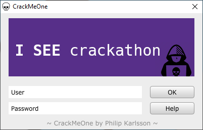
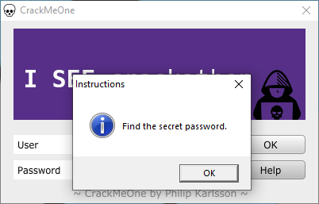
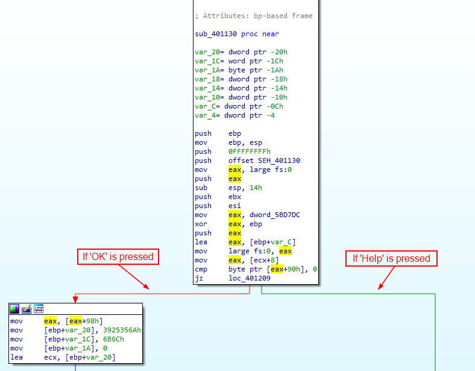
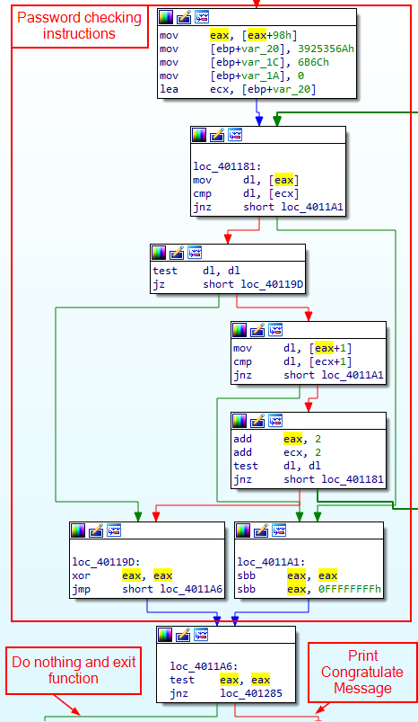
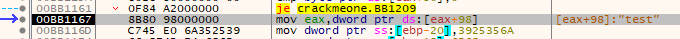
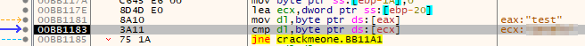
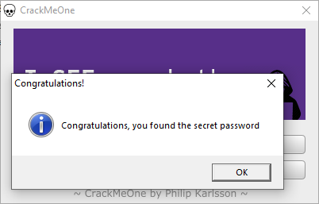

# CrackMeOne

Author: Philip Karlsson (ripxorip)

Link: https://github.com/ripxorip/crackmes

## Running the program
Upon running the program, a window with a username and password field appears.

Pressing the 'OK' button does not seem to do anything.



Pressing 'Help' opens a dialogue box which says 'Find the secret password.'




## Strings

Using strings, there were no strings that looked like it could be a password.

However, there are some notable strings such as:
```
Congratulations, you found the secret password
Congratulations!
Find the secret password.
Instructions
```

These strings are used in the main window and dialogue boxes of the program.

## Analysing the assembly instructions

Loading the executable into IDA, there is a large number of functions found.

To quickly get close to the relevant functions, I went to cross reference where the strings found earlier are used in the program.

The string 'Congratulations!' is referenced in the function `sub_401130`.



Jumping to that function, it looks confusing, but I can see that the general flow of this function is related to the 'OK' and 'Help' buttons in the program.



I am not exactly sure what the instructions are doing so I'll run it in x32dbg to get a better idea of what is happening.

## Debugging

Opening the program in x32dbg and setting a breakpoint at the function `sub_401130`, which is at `0x00BB1130` in my instance.

I left the user field as is and changed the password field to 'test' and pressed 'OK'. The x32dbg then stopped at the `sub_401130` breakpoint. 

Stepping through the instructions, I can see my input password appear at `[eax + 98]` and it is moved into `eax`.



Stepping further I can see my password being moved to the `dl` register and compared against a value pointed to by `ecx`.



This might just be the password, so I'll test it in the program again.



And it appears to be the password!

Turns out the password is simply loaded as raw hex values before being compared against the user input. 

