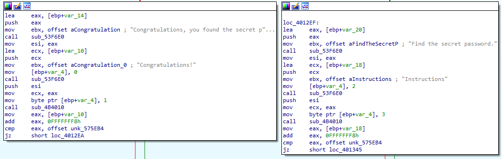
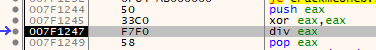
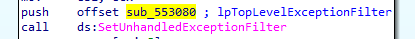
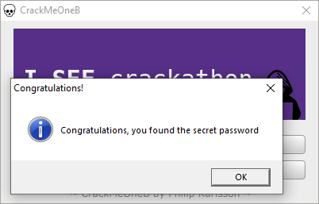

# CrackMeOneB

Author: Philip Karlsson (ripxorip)

Link: https://github.com/ripxorip/crackmes

## Running the program
The author stated that this is simialr to the previous version 'CrackMeOne'. 

Running the program shows a similar window to 'CrackMeOne' and the buttons behave the same. The most probable difference should be how the program checks the password.

## Analysing the assembly instructions

Using the same strings in 'CrackMeOne', I found the function `sub_401200` which references the strings.

```
Congratulations, you found the secret password
Congratulations!
Find the secret password.
```



I'll use x32dbg to step through the instructions to get a better idea of what its doing.

## Debugging

Setting a breakpoing at `sub_401200` in x32dbg and running with a random password, I found out that the program eventually reaches a divide by zero error. 



I can see that the code below looks to be similar to the previous version.
Although this is not the correct solution, I tried to no-op the `div` instruction to see what happens to the program.

The program continues to the part after the divide by zero and loads the correct password similar to the previous version.

However, reverting the no-ops and trying with the valid password still shows a divide by zero error. But trying the password in a non-debugged copy works correctly. 

Unsure of why this is happening, I compared the differences in the instructions between this program and `CrackMeOne`. 

I found out that the `CrackMeOne` did not have a call to `SetUnhandledExceptionFilter()`. Perhaps this is being used to catch the divide by zero error?

Searching on Google, I learnt that `SetUnhandledExceptionFilter()` is actually used as an anti-debugging technique. This explains why I was not able to get it to work in x32dbg as it will handle the execption by default instead of passing it to the unhandled exception filter.

Looking at the documentation for `SetUnhandledExceptionFilter()`, I see it accepts a pointer to a function to be called when an exception is caught.



`sub_553080` is a filter function that returns `0xFFFFFFF` which means to continue execution from the point of exception. Which will return to `sub_401200` and continue after the divide by zero.

Using x32dbg to pass the exception instead of handling it will allow the program to continue correctly and show the congratulatory message.

