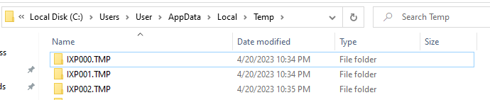
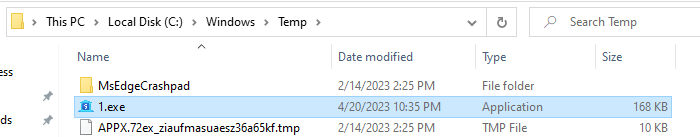

# Writeup

## Basic Information

MD5:87ef9c2cc503bc900ceeaef2ab802d83

SHA256:2958e5a56f8e43eecc073d15df9b232d30d40d39bc6b73dc373a3ff0a1bf2c5a

## Basic Static Analysis

### PEiD

PEiD's fast check shows that the sample might be packed

### PEBear

Looking at the section sizes, .data has a very small raw size compared to the virtual size, 0x200 raw and 0x1A48 virtual. This also hints that the sample has packed data.

Most of the sample's file size is from the .rsrc section.

### CFF Explorer

Looking at the resources in the sample, the manifest shows that the name of this sample is 'wextract'. Searching this on the internet shows that it is a legitimate windows program that extracts cabinet files. 

Opening a legitimate copy of 'wextract.exe' found in the SYstem32 folder and comparing it against the sample, the files sizes are very different with the sample being 1.14MB and the legitimate wextract.exe being only 143KB. 

This is definietly a modified wextract.exe.

Comparing the resources section of both files, the sample has additional sections of data

## Basic Dynamic Analysis

### Running without INetSim

Upon running the sample, process explorer shows the sample spawning multiple sub-processes with random names and some of the processes will spawn a WerFault.exe before closing. 

After a few seconds the final state of the process tree is as follows

Looking at Process Monitor, the sample will create a folder in `C:\Users\User\AppData\Local\Temp` called `IXP000.TMP`.

After that it will write two executable files called `un736830.exe` and `si034106.exe`

Looking at the directory there are actually 2 more folders with a similar naming scheme to the folder `IXP000.TMP`

Inside the `IPX000.TMP` folder there is the 2 executables created by the sample. 

---

#### Stage 2 un736830.exe

Filtering to `un736830.exe` in process monitor, it creates a folder `IPX001.TMP` and writes 2 executables, `un663551.exe` and `rk286905.exe`.

---

#### Stage 3 un663551.exe

Filtering to `un663551.exe` it shows that it writes 2 executables into the folder `IPX002.TMP`, `pr091251.exe` and `qu000393.exe`. 

`un663551.exe` will then run `pr091251.exe` followed by `qu000393.exe`

However it then deletes the 2 executables with `SetDispositionInformationEX` with the flags `FILE_DISPOSITION_DELETE`, `FILE_DISPOSITION_POSIX_SEMANTICS` and `FILE_DISPOSITION_FORCE_IMAGE_SECTION_CHECK`.

This explains why the folder is empty when checking it.

---

#### Stage 4 qu000393.exe

Filtering to `qu000393.exe` shows that it creates an executable `1.exe` in the directory `C:\Windows\Temp`.
It then runs `1.exe`. Both `1.exe` and `rk286905.exe` from Stage 2 have the same icon and description of `Nirtro CPU`.
It then calls WerFault.exe with the arguments `-u -p 1248 -s 1336`.
#### Stage 4 pr091251.exe
It then calls WerFault.exe with the arguments `-u -p 1520 -s 1224`.

Looking at process explorer again, the two processes `1.exe` and `rk286905.exe` can be seen.

Using process explorer to perform a full dump of both processes, and using strings, the dump of `1.exe` contains multiple of the string `net.tcp://185.161.248.90:4125/` this might be a C2 server.

Viewing the dump of `rk286905.exe` also contains the same string `net.tcp://185.161.248.90:4125/`.
