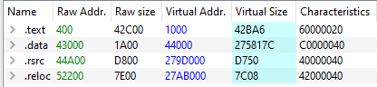
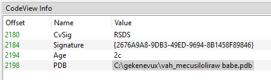
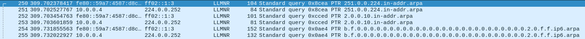

# Writeup

Malware sample obtained from Malware Bazaar (https://bazaar.abuse.ch)

## Basic Information
MD5: `1398c79b2f5e80d6a1861b750662a7f8`

SHA256: `a4c8c3d0f28c8e382f926676d31b0eb12e9c0c775f20219499731fe0b0e94ac9`

## Basic Static Analysis

### PEiD
PEiD shows that the sample might be packed with the entropy and fast check.

### PE-Bear
PE-Bear shows that the .data section has a large difference in the raw and virtual sizes.


This might mean the section is packed.

### FLOSS
Floss shows multiple strings that looks obfuscated.
```
fovojokoxolarupedozuci sedorapagafoha
wezeciloxevetojaguwasofaso xayamopixarasawasu jimulifufejopomemofaside
liberamihiwidifukomuza vanaxofesejexikugagufoginod netarezun
```
There is also a large chunk of text similar to the strings above.

There is also a string `C:\gekenevux\vah_mecusiloliraw babe.pdb` that is also shown in PE-Bear under CodeView Info in the debug tab.



## Basic Dynamic Analysis

### Running without INetSim

Upon execution, CPU usage jumps to 100% for a few seconds before dropping.

Process Explorer only shows the sample exe and it does not spawn any child processes.

Regshot showed no notable changes to the registry.

Process Monitor shhows that the sample loaded multiple dlls not shown in initial static analysis imports.
```
bcryptprimitives.dll
crypt32.dll
cryptsp.dll
bcrypt.dll
cryptbase.dll
mswsock.dll
```

It looks like the sample might have some form of encrpytion/decryption and network connectivity.

### Running with INetSim

Wireshark found a few ipv4 and ipv6 Link-local Multicast Name Resolution(LLMNR) packets with the destination of `224.0.0.252` and `ff02::1:3` for ipv4 and v6 respectively.



The queries have a domain name pointer to different domains.
```
251.0.0.224.in-addr.arpa
2.0.0.10.in-addr.arpa
b.f.0.0.0.0.0.0.0.0.0.0.0.0.0.0.0.0.0.0.0.0.0.0.0.0.0.0.2.0.f.f.ip6.arpa
```

There seems to be nothing new happening when running the sample with INetSim.


