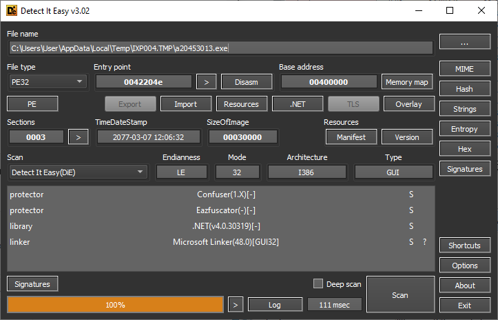

# Writeup

Sample was obtained from malware bazaar (http://bazaar.abuse.ch)

SHA256: c4250ccabb3d62c075af65f5048650150120b5d6c5da45f843bc27a86ce22850

# 1. Initial Analysis

Oening the file in Detect It Easy shows that it contains Microsoft Cabinet files, looking at the properties of the file shows that it is a Win32 Cabinet Self Extractor with the original name of WEXTRACT.EXE. 

This file might be a dropper with an embedded file inside the cabinet file. 

## 1.1 Running the sample

Upon running, process explorer shows the sample spawning a child process with the name `i83191038.exe` which then spawns another child process. This continues until a final child process `a20453013.exe`.


Looking at process monitor, the sample file creates a child process with the directory `C:\Users\User\AppData\Local\Temp\IXP000.TMP\i83191038.exe`.

Opening the directory I see there are other folders similar to the folder name `IXP000.TMP`.


Looking into the folders shows the other child processes spawned but the sample along with a few other executables.

It looks like the sample is amulti-stage dropper for the file `a20453013.exe`. 

## 1.2 a20453013.exe

TCPView shows that this file is constantly sending out SYN connections to an ip `185.161.248[.]73:4164` It attempts to connect via different local ports if connection fails.

# 2 Analysing the Payload

Since there are no other child processes spawned after `a20453013.exe` and it is sending out SYN connections, it is safe to assume that this file is the malicious payload.

Luckily, the file is not deleted from the temp folder so there is not need to extract the binary from the main sample file.

Opening it in Detect It Easy shows that it is a .NET executable and obfuscated with Confuser and Eazfuscator. 



Using `de4dot`to attempt to deobfuscate the file and then using `dnSpy` to decompile the output. 

`dnSpy` shows many class files in the program. 

Using dnSpy to go to the entry point, the main function only calls a `WriteLine` function in the `MicrosoftWinUserPreferenceChangingEventArgsh` class.

## 2.1 C2 Server Connection

In the `WriteLine` function, there is a call to `SystemSecuritySecureStringMarshalm.Read()` and 2 arguments are passed in, which are variables in the class `SystemComponentModelByteConvertery`, `IP and `Key`.

Examining these variables reveal some base64 encoded text.


Attempting to decode this text with cyberchef reveals nothing much.

Looking at the function which the `IP` and `Key` arguments are passed to, it shows that the base64 string is first decoded, then xor-ed with the key and then base64 decoded again. Running this in cyberchef reveals the IP which the sample is attepting to connect to.


There is also another base64 variable `ID` which decodes to 'most'. Perhaps this is the identifier used to identify this malware in the C2 server.

## 2.2 Information Gathering

There is a class `SystemNetMimeContentDispositionf` which seems to have functions that gather information on the victim's computer


# 3 Conclusion

This looks to be a malware that steals information and then sends it to the C2 server. Uploading `a20453013.exe` to virustotal reveals that it is indeed a stealer with many vendors reporting it as redlinestealer. 

IOCs:
```
Folders:
AppData\Local\Temp\IXP000.TMP
AppData\Local\Temp\IXP001.TMP
AppData\Local\Temp\IXP002.TMP
AppData\Local\Temp\IXP003.TMP
AppData\Local\Temp\IXP004.TMP
```

File hashes: 
```
SHA256: c4250ccabb3d62c075af65f5048650150120b5d6c5da45f843bc27a86ce22850 (main sample file)
4afaf73cf11ab43dd22f8598c4e5221c03052ed11c1ccd4b1e3874187baefd62
(i83191038.exe)
7d8805bb6b0e79927186151397e7bf35638ce3776775fc0557c6506585662032(i41240003.exe)
b54d842d60146838b645aec4bc6d3f158c05a1acf0d2b769d63d25fde8873fe8
(i13811721.exe)
cb4539dba7799e4a0b85ae95d4317521d79ca1ae9da2f81ebb99ff4945b531f1
(i05074303.exe)
09dc302950359a29672c2890ea85cdd202ed198aa6f22c99b653047c51e562dd (a204513013.exe)
```

IP address: 
```
185.161.248[.]73:4164
```


