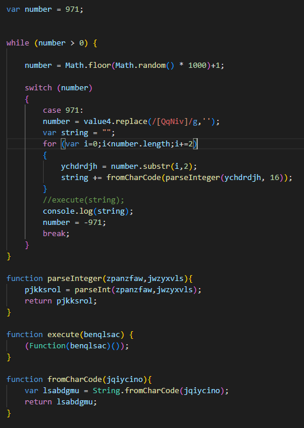
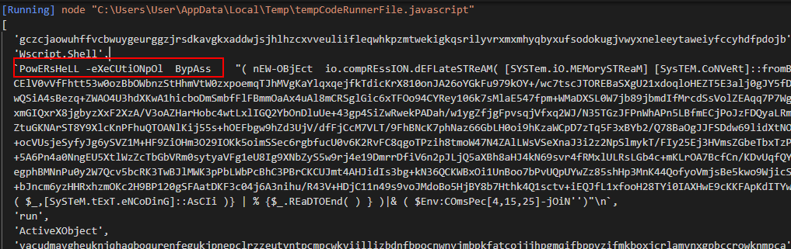
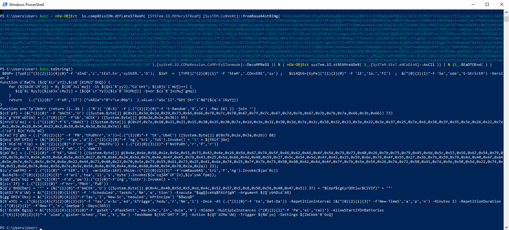

# Writeup

Sample was obtained from Malware Bazaar (http://bazaar.abuse.ch)

SHA256: 51e81f26e93788c213139654365a5a5723a65b6c08662c68b38b1825338b8651

## Initial Analysis

This sample was tagged as javascript in the Malware Bazaar website.

Downloading and viewing the contents with a text editor shows it is obfuscated javascript. There are many comments with random words found among the javascript code.

There is also multiple large chunks of text, looking at the variable names, the multiple chunks of text combine into one.

Removing the comments and renaming the variables to readable names,



`value4` is the variable containing the large chunk of text.

Looking at the what the code does,

1. Generates a random number
2. Checks if the number is equal to 971
3. Removes instances of the characters `QqNiv` from `value4` leaving hexadecimal values
4. Converts the hex values in `value4` into chars
5. Executes the decoded script in `value4`

Replacing the `execute()` function with a console print, I am able to extract the contents of `value4` by piping the output into another file.

## Stage 2

Opening the file reveals it is another javascript file which contains a large amount of variables.

Examining the file, many of the variables are not used. And there is a function `rgvcarolrck()`.

There is also a few long strings that combine to a single string `xrvztmlp` which is then put into `rgvcarolrck()`. The returned result is then split with the delimiter `!` and stored inside `dudyewel`.


Copying the function and `xrvztmlp` into a seperate javascript file and running it to get the result in `dudyewel`, it shows an array which contains powershell commands along with a base64 encoded string.



## Stage 3

By copying only the new object part without the execution, storing it in an object in powershell and using toString(), I was able to obtain the decrypted code by using powershell.



Saving this output into a text file for examination, the file has multiple ways of obfuscation including random names, using '`' to split strings, and using the format operator in powershell. 

There is a function `U`BaCTk()` which takes in a byte array of hex values and a key, it then xors the array elements with the key.

There is also a function `pnx`Tp`UbHrr()` that returns a random hex value from 0x0 to 0xF.


This function is used multiple times to decode some hex strings
```
'http://159.65.42[.]223/r/'
'bai'
'~/AppData/Local/Microsoft/2Ò¢.³3v°owerrÂ..._'
`.vbs`
'c = WScript.Arguments(0)
set s = CreateObject("WScript.Shell")
s.Run "powershell.exe -exec bypass " & c,0'
`iexxiwr}useb`
```

There are also strings obfuscated by using the format operator for powershell (-f), copying these and using powershell to resolve the formatting reveals
```
UBaCTk
pnxTpUbHrr
ToString
whoami
FromBase64String
writeallbytes
pwd
New-ScheduledTaskAction
New-ScheduledTaskPrincipal
New-ScheduledTasktrigger
New-ScheduledTaskSettingsSet
Register-ScheduledTask
```

These strings hints at persistence by creating scheduled tasks.

With further analyis, this files attempts to
1. Create a .vbs file with a random name in the AppData/Local/Microsoft folder
2. Write the decoded powershell script into the vbs file
3. Create a new scheduled task which will run the .vbs script with the url and the command to download a file from the url.
4. The scheduled task will repeat once every minute for a duration of 365 days.

## Conclusion

I will not attempt to download the file from the url as I do not want to attempt to connect to a malicious url.

This sample looks to be a dropper with persistence mechanisms.

Indicators of Compromise:
URL - `http://159.65.42[.]223/r/bai/`


