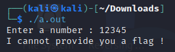
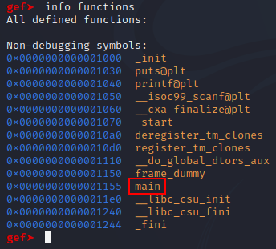
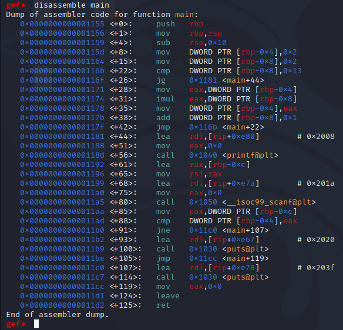
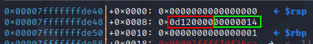
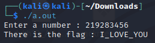

GDB Basics crackme created by Varsovie, from https://crackmes.one/crackme/645d3d4e33c5d43938913079

# Initial Analysis

Running the program, it asks for a number, putting a random number returns a message `I cannot provide you a flag !`

Since the title of the crackme is GDB Basics, I assume author wanted GDB to be used on this crackme.

Loading into gdb, and using the command `info functions` I can see the `main` function.

# Disassembling

Using the command `disassemble main` to disassemble the main function,

Looking at this function, it looks to be a loop before `printf` and `scanf` is called.

The loop seems to be setting up a number in the stack and the exit condition is the `CMP` instruction at `0x116b` where it compares the value at `[rbp-0x8]` and `0x13` and jumps when the `[rbp-0x8]` is larger than `0x13`.

After the loop, the program will print the string `Enter the number:` and then gets the user input and stores it into `[rbp-0xc]`. This value is then loaded into the `EAX` register and then compared against `[rbp-0x4]`. 

# Debugging with GDB

Setting a breakpoint at main with `break main` and running with `run`,

Stepping through the program until the loop finishes and before it continues to the `printf`.
The stack after the loop looks like this:

The green box shows the value refered to be `[rbp-0x8]` is `0x14`. Since it is higher than `0x13` the loop exits. 

The red box shows the value of `[rbp-0x4]` which is initally set as `0x2` and is multiplied by the value in `[rbp-0x8]` every loop. Since the number gets so big, it is overflowed and only the bottom 4 bytes remain. The full value is `0x0360 5726 0d12 0000`, due to the overflow, only `0x0d12 0000` remains.

The user's input is then compared against this value. Therefore, the key to this program is `219283456`.

The flag is `I_LOVE_YOU`.
