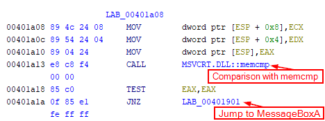
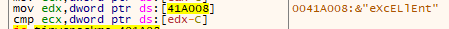
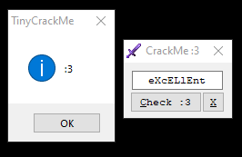

`TinyCrackMe` crackme created by bang1338, from https://crackmes.one

# Initial Analysis

Running the program shows a small window with a textbox and 2 buttons `Check :3` and `X`. 

The `Check` button will check the text in the textbox and show a child window whether the password is correct or not. 

THe `X` button simply closes the program with a child window showing credits.

# Analysing the assembly

Loading into Ghidra to analyse the program, there are some strings which are seen in the program itself. 

```
TinyCrackMe
by bang1338^BGSPA :3
Maybe something wrong...
bang1338!
```

The string `Maybe something wrong...` is the error message that appears when the wrong password is entered.


Jumping to the x-ref of the string to see where it is used, I might be able to get close to where the important instructions are.

The string is used in the function `MessageBoxA` which makes sense when the child window is created when the password is wrong.

Looking at which instruction jumps to this `MessageBoxA` call, there is a `memcmp` function before the `EAX` register is tested.



I'll try to debug this program by setting a breakpoint here.

# Debugging

Loading into x32dbg and running until the entrypoint, since the base address is the same, I can jump to `0x00401a13` in x32dbg and set a breakpoint there.

Unfortunately, upon running the program, it does not hit the breakpoint. Upon more investigation, I found that the program does not reach the `memcmp`. There is another `CMP` instruction before it jumps to the `memcmp`. 

After some testing, it actually compares the length of the input first, before jumping to the `memcmp`. 

I also noticed the program actually already loaded the correct password when it is comparing the length of the input. 



Using `eXcELlEnt` as the input gives the correct window.




