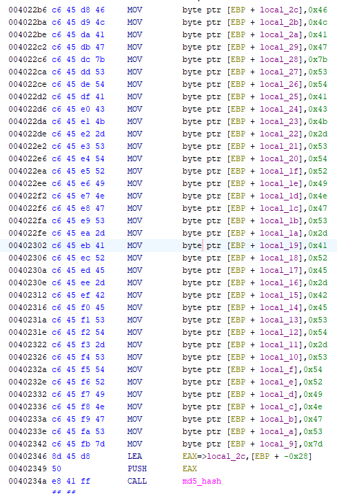
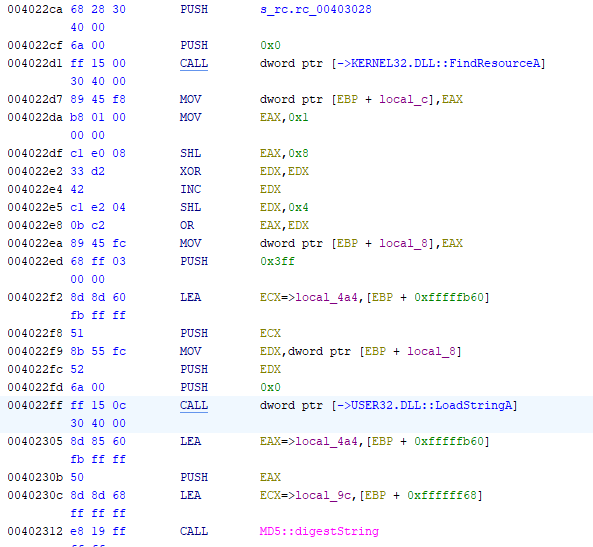

# Basic Malware RE Writeup

This room can be found at https://tryhackme.com/room/basicmalwarere

This room is made by w4tchd0g

# Strings Challenge 1
 
 This room is focused on static analysis, therefore, there is no need for debuggers or running the program.


## Strings

Using `strings`, there are many `FLAG{}` strings. This makes it hard to know which one is the real flag.

```
FLAG{THE-DEPICTED-THE-IMPORTANT-THE}
FLAG{INCLUDES-COLLECTIVE-AND-SOCIALIST-INQUIRY}
FLAG{LAW-IDEOLOGICAL-INTO-THE-THE}
FLAG{COMPETENCE-ISSUE-PERSONAL-THE-LAW}
FLAG{MATTERS-POLITICAL-DETERMINATION-ITS-SOCIALIST}
FLAG{BODIES-PROMOTE-NATIONWIDE-COLLECTIVE-SOVIET}
FLAG{STATE-THEIR-WITHOUT-THE-REQUIRED}
...
```

## Ghidra

Since the strings are not much help, I used ghidra to load the program and see exactly what it is doing.

Looking at the program in the code browser, the program loads the string 
```
FLAG{CAN-I-MAKE-IT-ANYMORE-OBVIOUS}
```
before calling the md5_hash() function. 

Therefore, the flag is `FLAG{CAN-I-MAKE-IT-ANYMORE-OBVIOUS}`.

# Strings Challenge 2

## Strings

This time there isn't many strings compared to the previous challenge.

```
We've been compromised!
%02x
ExitProcess
KERNEL32.dll
memset
memcpy
sprintf
ntdll.dll
MessageBoxA
USER32.dll
...
```

The flag is probably stored in another form or encrypted.

## Ghidra

Opening up the program in code browser, I see the same call to the md5_hash() function.

But before the call, multiple hex values are loaded into a pointer.



This is probably the flag but it is loaded as hex values into a pointer.

Copying the hex values into Cyberchef and converting them to text, 
```
FLAG{STACK-STRINGS-ARE-BEST-STRINGS}
```

# Strings Challenge 3

## Strings

ASCII Strings:
```
rc.rc
We've been compromised!
%02x
ExitProcess
FindResourceA
KERNEL32.dll
memset
memcpy
sprintf
ntdll.dll
MessageBoxA
LoadStringA
USER32.dll
plaintext3.exe
```

Similar to Challenge 2, there are not many ASCII strings, however there are UTF-16 Strings which do contain flags.

```
2FLAG{WHATSOEVER-PRODUCT-INCIDENTAL-APPLICABLE-NOT}'FLAG{COPY-YOU-PROVISION
-DISCLAIMER-ARE}&FLAG{THE-LICENSED-WITHIN-SERVICES-LAW}&FLAG{FOR-OPERATING-
AND-APPLICABLE-MAY}!FLAG{FOR-AND-THIS-THAT-OPERATING}0FLAG{REFERENCED-CONFL
ICT-EULA-MICROSOFT-RESPECT} 
...
```

## Ghidra

Opening the program in the code browser,

 Upon more research, I see that the flag strings are actually loaded from a resource file attached with the program.

 The resource file contains a string table which holds all the flag strings.

 The program will first call `FindResourceA()` to get the location of the wanted string before calling `LoadStringA()` to load the string into memory.

 This string is then given to `MD5::digestString()` to obtain the hash.



 Ghidra has pointed out which string is being loaded from the resources
 ```
 FLAG{RESOURCES-ARE-POPULAR-FOR-MALWARE}
 ```

