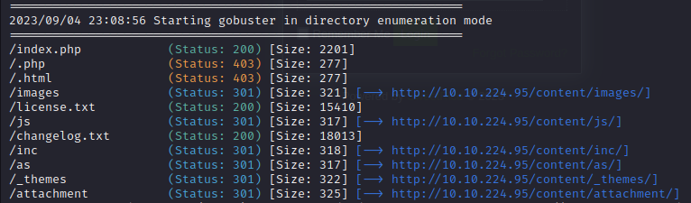
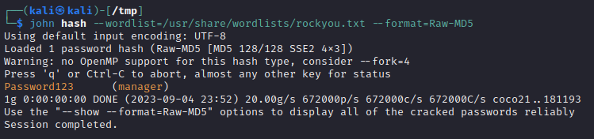
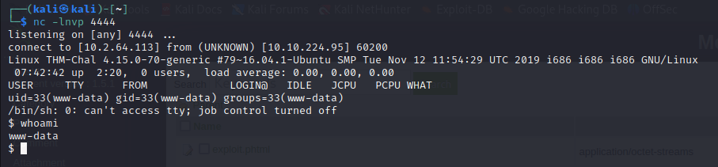
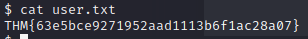
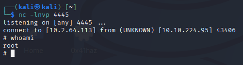
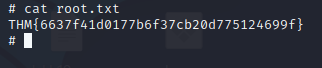

# LazyAdmin Writeup

This room can be found at https://tryhackme.com/room/lazyadmin

This room is created by MrSeth6797

# Nmap scanning

```
PORT   STATE SERVICE VERSION
22/tcp open  ssh     OpenSSH 7.2p2 Ubuntu 4ubuntu2.8 (Ubuntu Linux; protocol 2.0)
| ssh-hostkey: 
|   2048 497cf741104373da2ce6389586f8e0f0 (RSA)
|   256 2fd7c44ce81b5a9044dfc0638c72ae55 (ECDSA)
|_  256 61846227c6c32917dd27459e29cb905e (ED25519)
80/tcp open  http    Apache httpd 2.4.18 ((Ubuntu))
|_http-server-header: Apache/2.4.18 (Ubuntu)
| http-methods: 
|_  Supported Methods: GET HEAD POST OPTIONS
|_http-title: Apache2 Ubuntu Default Page: It works
Service Info: OS: Linux; CPE: cpe:/o:linux:linux_kernel
```

Nmap shows that 2 ports are open, 22 and 80.

# Gobuster

Going accessing the ip on a browser shows the apache default page.

I'll use `gobuster` to search for any other pages that might exist.

`gobuster` found a directory called `/content`. After looking around for awhile, I got stuck at this point as I couldn't find much info on sweetrice such as the version.

Searching online, I realized that I could use gobuster on `/content` as well. It didn't occour to me.

Running `gobuster` on `/content`, there is much more information to work with.



Looking at `changelog.txt`, I see the latest update is `v1.5.1`, I'm assuming that the current version being used is `v1.5.1`. Looking in the `/inc` directory, `latest.txt` contains the text `1.5.1`. This further suggests that the version is indeed `1.5.1`.

There is also a folder called `mysql_backup` with a sql backup script. Maybe the backup file has useful information.

## Sql Backup Script

Looking through the script, I see something of note.
```
s:5:\\"admin\\";s:7:\\"manager\\";
s:6:\\"passwd\\";s:32:\\"42f749ade7f9e195bf475f37a44cafcb\\";
```
This might be some possible credentials.

Using john to crack the hash,


## /as Directory

Accessing the `/as` directory, a login page is seen. Using the credentials from the backup script, `manager:Password123` the login is successful.

# Reverse Shell

Looking through the menus in the management page, I see an attachment menu however there was no way to upload anything. I also saw a media center page which allowed uploads. 

I used the pentestmonkey's php reverse shell and attempted to upload the php file. However, the file couldn't not upload even after trying a few times and thinking it was my internet, but I realized it could be the website not allowing .php files.

I renamed the expoit to `.phtml` and it was uploaded successfully. Clicking on the file ran it and connected to my net cat listener.



In the home folder, there is a user called `itguy`, inside there is a `user.txt` which contains the user flag.



There is also another file called `mysql_login.txt` and it contains some credentials `rice:randompass`.

After looking into the database with the credentials, I didn't find anything interesting.

Using `sudo -l`, 

```
User www-data may run the following commands on THM-Chal:
    (ALL) NOPASSWD: /usr/bin/perl /home/itguy/backup.pl
```

`backup.pl` will run a script `/etc/copy.sh`, which is editable by us. Since `copy.sh` contains a reverse shell, I can simply edit the IP and PORT to point to my machine. And running the sudo command gives a root reverse shell.



With root, I can now access the root folder and view `root.txt`.




