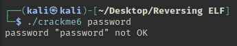

# Reversing ELF writeup 

This room can be found at https://tryhackme.com/room/reverselfiles

This room is made by mrpvr

## Task 1

This room is about reversing linux ELF files, so I will make use of Ghidra and the GDB debugger.

### Running the program

`./crackme1` simply prints out the correct flag, `flag{not_that_kind_of_elf}`

But I'll analyse the function to figure out how it works.

### Strings

`strings` did not show much information other than some possible references to function calls such as `puts` and `memset`.

### Ghidra

Based on ghidra's decompiler, the `main` function will initalize 2 arrays of different sizes. 

```
char array1[32]
undefined4 array2[27]
```

It will then fill up `array2` with random hex values with the last array position being filled with a large hex value of `0xffffffbf`, this might be due to the type for `array2` being `undefined4`. 

Changing the type to `char` and adjusting the array size to `32` fixed this issue.

```
char array1[32]
char array2[32]
```

The code now fills all 32 array indexes with hex values.

`main` will then use `memset()` to fill up the first 27 array indexes  of `array1` with `0x41`. Then with a `for` loop, it will add the values of `array1` and `array2` before storing it in `array1`.

It will then print out `array1` with `puts()`. Based on this function call, `array1` and `array2` might be C-strings.


## Task 2

### Running the program

Running the program shows a message asking to run the program with the password as an argument.

Running it with `password` as the arugument shows `Access denied.`


### Strings

Running strings reveals some useful strings, such as `Access denied.` seen earlier.

```
puts
printf
memset
strcmp
...
Usage: %s password
super_secret_password
Access denied.
Access granted.
```

There is an interesting string `super_secret_password` which might be the actual password. So I'll try running the program with it as the argument.


The flag is `flag{if_i_submit_this_flag_then_i_will_get_points}
`

### Ghidra

I will use ghidra to see how the program works.

The `main` function first checks if there is an arguement provided by checking if the value of `argc` is equal to 2 (which means there is 1 argument provided).

If `argc` is not equal to 2, it will print the usage message and quit.

If `argc` is equal to 2, it will load the value of `argv[1]` and compare it against the string `super_secure_password` using `strcmp()`.

If `strcmp()` does not return 0, the program will print the `Access denied.` string. If not it will print `Access granted.` and run the `giveFlag()` function. 

The `giveFlag()` function works similarly to the `crackme1` where it loads 2 c-strings and adds the chars together for each index. But it loads the c-string from the `.rodata` section.


## Task 3

### Running the program

Similar to crackme2, this one asks for an argument. Running with an argument gives a message `Come on, even my aunt Mildred got this one!`.


### Strings

```
puts
strlen
malloc
stderr
fwrite
fprintf
strcmp
...
Usage: %s PASSWORD
malloc failed
ZjByX3kwdXJfNWVjMG5kX2xlNTVvbl91bmJhc2U2NF80bGxfN2gzXzdoMW5nNQ==
Correct password!
Come on, even my aunt Mildred got this one!
ABCDEFGHIJKLMNOPQRSTUVWXYZabcdefghijklmnopqrstuvwxyz0123456789+/
```

There is one string that looks base64 encoded, I'll try to decode it with CyberChef.

`f0r_y0ur_5ec0nd_le55on_unbase64_4ll_7h3_7h1ng5`

This might be the password so I'll try it on the program.


And it is the correct password so it must be the flag.

### Ghidra

Ghidra was not able to identify the `main` function so I'll just look through the functions to see if anything is interesting enough.

I found one function `FUN_080484f4` that looks like the main function with `argc` and `argv` arguments and references to the strings such as the base64 encoded string and `Correct password!`.

I'll call `FUN_080484f4` the `main` function from now on.

`main` will first check for arguments before allocating memory for the argument using `malloc()`.

It will then call a function `FUN_080486b0` which takes in the user input, malloc return pointer address and the length of the user input.

Looking into this function, it looks to be the base64 encoding function as it makes use of the string `ABCDEFGHIJKLMNOPQRSTUVWXYZabcdefghijklmnopqrstuvwxyz0123456789+/` which is a tell-tale sign of base64 encoding.

It will return the base64 encoded string to `main`. 

`main` will then find the length of the base64 string and compare it against the string `ZjByX3kwdXJfNWVjMG5kX2xlNTVvbl91bmJhc2U2NF80bGxfN2gzXzdoMW5nNQ==`.

If the strings match it will print `Correct password!` else it will print `Come on, even my aunt Mildred got this one!`


## Task 4

### Running the program

Running the program will show a message that the string is hidden and that `strcmp()` is used.


### Strings

```
puts
__stack_chk_fail
printf
strcmp
...
password OK
password "%s" not OK
Usage : %s password
This time the string is hidden and we used strcmp
```

Just like the program said, the password is not visible with `strings`.

### Ghidra

The `main` function first checks for the argument count before passing the argument into a function `compare_pwd()`.

In `compare_pwd()`, several variables are initialized with some hex values.
```
local_28 = 0x7b175614497b5d49;
local_20 = 0x547b175651474157;
local_18 = 0x4053;
local_16 = 0;
```

The user input is then compared against `local_28` with `strcmp()`. This hex values must be the password.

Using CyberChef, the hex values are decoded into 
`my_m0r3_secur3_pwd`

Trying it with the program,


The password is correct.

## Task 5

### Running the program

Upon running, the program asks for an input. If the password is wrong, the string `Always dig deeper` is printed.


### Strings

```
strncmp
__isoc99_scanf
puts
__stack_chk_fail
strlen
atoi
...
Enter your input:
Good game
Always dig deeper
```

The correct password output is `Good game` as is said in the task page. There are function names such as `strncmp`, `atoi` and `strlen`. These functions might be used in the program.

### Ghidra

The `main` function first gets the user input and then compares it to a bunch of hex values with `strcmp`. If the strings match, `Good game` will be printed if not `Always dig deeper` will be printed.

```  
local_38 = 0x4f;
local_37 = 0x66;
local_36 = 0x64;
local_35 = 0x6c;
local_34 = 0x44;
local_33 = 0x53;
local_32 = 0x41;
local_31 = 0x7c;
local_30 = 0x33;
local_2f = 0x74;
local_2e = 0x58;
local_2d = 0x62;
local_2c = 0x33;
local_2b = 0x32;
local_2a = 0x7e;
local_29 = 0x58;
local_28 = 0x33;
local_27 = 0x74;
local_26 = 0x58;
local_25 = 0x40;
local_24 = 0x73;
local_23 = 0x58;
local_22 = 0x60;
local_21 = 0x34;
local_20 = 0x74;
local_1f = 0x58;
local_1e = 0x74;
local_1d = 0x7a;
```

Using CyberChef to convert the hexadecimal values to ascii characters,

```OfdlDSA|3tXb32~X3tX@sX`4tXtz```

Trying this string as the input for the program,


The flag is the decoded hexadecimal string.

## Task 6

### Running the program

Running with out arguments,


With argument,



### Strings
```
puts
printf
...
password OK
password "%s" not OK
Usage : %s password
Good luck, read the source
```

### Ghidra

The `main` function will get the user input and pass the input to the `compare_pwd` function.

Looking at the `compare_pwd` function, it takes the user input and passes it again to another function `my_secure_test`.

`compare_pwd` expects the return value for `my_secure_test` to be `0` to print out `password OK`.

`my_secure_test` performs multiple `if` checks and returns `0` only if every char matches, if not it will return `0xffffffff`.

Looking at every if check, the user input is compared against `1337_pwd`.

Trying this as the input,


`1337_pwd` is the flag.

## Task 7

### Running the program

The program starts with a menu with 3 options.
```
Menu:

[1] Say hello
[2] Add numbers
[3] Quit
```


Option 1 will ask for a name as input and prints the name followed by the menu again.

Option 2 will ask for 2 numers and add them together before showing the menu again. Entering a character instead of number will show an error message before quitting the program.

Option 3 will simply quit the program.

### Strings
```
puts
printf
memset
...
Menu:
[1] Say hello
[2] Add numbers
[3] Quit
[>] 
Unknown input!
What is your name? 
%99s
Unable to read name!
Hello, %s!
Enter first number: 
Unable to read number!
Enter second number: 
%d + %d = %d
Goodbye!
Wow such h4x0r!
Unknown choice: %d
```

There is a string `Wow such h4x0r!` which was not shown during the use of the program. This string might be printed if the flag is found. So I'll analyse where this string is used in the program with Ghidra.

### Ghidra

Examining the `main` function, the user input is compared against multiple values which will then run different parts of the program.

There is an extra `if` check which compares against the value `0x7a69`. It will then print out `Wow such h4x0r!` before calling `giveFlag()`.

Running the program and entering `31337` which is `0x7a69`,


The flag is `flag{much_reversing_very_ida_wow}`.

## Task 8

### Running the program


### Strings

```
puts
printf
memset
atoi
...
Usage: %s password
Access denied.
Access granted.
```

### Ghidra

Examining the `main` function, the user input is passed through `atoi()` and the result is compared against `-0x35010ff3`. 

Since `atoi()` converts the user input into a number, converting `-0x35010ff3` to a decimal number,
`-889262067` and using the number as the input into the program,


The flag is `flag{at_least_this_cafe_wont_leak_your_credit_card_numbers}`

