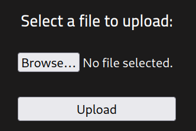
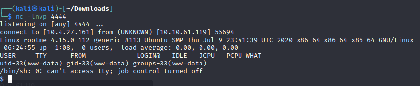
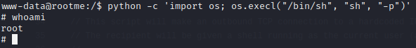
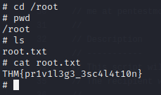

# RootMe Writeup

The room can be found at https://tryhackme.com/room/rootme

The room is created by Reddyyz

# Task 2

The first task is to deploy the machine and the second task is to perform some reconnissance. 

## Nmap

Using `nmap -v -sV -sC 10.10.61.119`,

```
PORT   STATE SERVICE VERSION
22/tcp open  ssh     OpenSSH 7.6p1 Ubuntu 4ubuntu0.3 (Ubuntu Linux; protocol 2.0)
| ssh-hostkey: 
|   2048 4ab9160884c25448ba5cfd3f225f2214 (RSA)
|   256 a9a686e8ec96c3f003cd16d54973d082 (ECDSA)
|_  256 22f6b5a654d9787c26035a95f3f9dfcd (ED25519)
80/tcp open  http    Apache httpd 2.4.29 ((Ubuntu))
|_http-server-header: Apache/2.4.29 (Ubuntu)
| http-cookie-flags: 
|   /: 
|     PHPSESSID: 
|_      httponly flag not set
|_http-title: HackIT - Home
| http-methods: 
|_  Supported Methods: GET HEAD POST OPTIONS
Service Info: OS: Linux; CPE: cpe:/o:linux:linux_kernel
```

There are 2 ports open, 22 and 80.

Apache 2.4.29 is running on port 80.

SSH is running on port 22.

Assessing port 80 with a browser shows a webpage with the title `root@rootme:~#` and a question `Can you root me?`

Inspecting the page does not reveal much information.

## Gobuster

Running gobuster to search for any directories or pages,

```
/.html                (Status: 403) [Size: 277]
/.php                 (Status: 403) [Size: 277]
/index.php            (Status: 200) [Size: 616]
/uploads              (Status: 301) [Size: 314] [--> http://10.10.61.119/uploads/]
/css                  (Status: 301) [Size: 310] [--> http://10.10.61.119/css/]
/js                   (Status: 301) [Size: 309] [--> http://10.10.61.119/js/]
/panel                (Status: 301) [Size: 312] [--> http://10.10.61.119/panel/]
```

There is a directory called `uploads` however accessing the page shows that its empty.

`/css` contains two css files `home.css` and `panel.css`

This seems interesting as `home.css` is used for the index page. This might mean `panel.css` might be used for another webpage.

Gobuster also found a page called `/panel` which might be related to `panel.css`.

Accessing `/panel` reveals a file upload page. This might be related to the `/uploads` directory.



Perhaps a php reverse shell might be usable here.

## Uploading a reverse shell

Using pentestmonkey's php reverse shell and uploading it, there is an error message.

`PHP não é permitido!`

This might mean there is some file type checking before uploading.

PHP has multiple possible file extensions
```
.php
.php3
.php4
.php5
.phtml
```

Using the phtml extension, the file is uploaded successfully.

Looking at the `/uploads` page, the file I uploaded is there. Starting a `netcat` listener and clicking on the file, a reverse shell is created.



Searching for `.txt` files using `find`, I found a `user.txt` found in `/var/www`.

`THM{y0u_g0t_a_sh3ll}`

## Privilege Escalation

### SUID bit

Using `find` to search for binaries with the SUID bit set for possible privilege escalation,

The binary that stands out is `usr/bin/python`.

Using the website GTFObins, python can be used to escalate privileges with the command
`python -c 'import os; os.execl("/bin/sh", "sh", "-p")'`



Now we can access the root folder and get the root flag.



`THM{pr1v1l3g3_3sc4l4t10n}`

