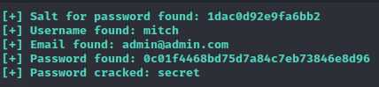

# Simple CTF Writeup

This room can be found at https://tryhackme.com/room/easyctf

This room is created by MrSeth6797

# Task 1

## Nmap

Using nmap to scan for open ports,

```
PORT     STATE SERVICE VERSION
21/tcp   open  ftp     vsftpd 3.0.3
| ftp-syst: 
|   STAT: 
| FTP server status:
|      Connected to ::ffff:10.4.27.161
|      Logged in as ftp
|      TYPE: ASCII
|      No session bandwidth limit
|      Session timeout in seconds is 300
|      Control connection is plain text
|      Data connections will be plain text
|      At session startup, client count was 1
|      vsFTPd 3.0.3 - secure, fast, stable
|_End of status
| ftp-anon: Anonymous FTP login allowed (FTP code 230)
|_Can't get directory listing: TIMEOUT
80/tcp   open  http    Apache httpd 2.4.18 ((Ubuntu))
|_http-title: Apache2 Ubuntu Default Page: It works
| http-methods: 
|_  Supported Methods: GET HEAD POST OPTIONS
| http-robots.txt: 2 disallowed entries 
|_/ /openemr-5_0_1_3 
|_http-server-header: Apache/2.4.18 (Ubuntu)
2222/tcp open  ssh     OpenSSH 7.2p2 Ubuntu 4ubuntu2.8 (Ubuntu Linux; protocol 2.0)
| ssh-hostkey: 
|   2048 294269149ecad917988c27723acda923 (RSA)
|   256 9bd165075108006198de95ed3ae3811c (ECDSA)
|_  256 12651b61cf4de575fef4e8d46e102af6 (ED25519)
Service Info: OSs: Unix, Linux; CPE: cpe:/o:linux:linux_kernel
```

Room Question: How many services are running under port 1000?
`2`, 21 and 80.

Room Question: What is running on the higher port?
`ssh` ssh is running on the highest port, 2222.

According to nmap scans, FTP does allow anonymous login and the apache server has a robots.txt. These might lead to some information.

`robots.txt` did not have much information.

## FTP
Connecting to the ftp server as an anonymous user,

I see a directory called `pub`, changing to that directory,
there is a file called `ForMitch.txt`. 

It contains
```
Dammit man... you'te the worst dev i've seen. You set the same pass for the system user, and the password is so weak... i cracked it in seconds. Gosh... what a mess!
```

## Gobuster

Using Gobuster,

```
/.php                 (Status: 403) [Size: 290]
/index.html           (Status: 200) [Size: 11321]
/.html                (Status: 403) [Size: 291]
/robots.txt           (Status: 200) [Size: 929]
/simple               (Status: 301) [Size: 311] [--> http://10.10.78.95/simple/]
```

Accessing `/simple` a page containing a site called `CMS Made Simple`. Looking around the version of this site can be found, 2.2.8.

Searching online for any exploits for `CMS Made Simple v2.2.8`, there is a CVE-2019-9053 which involves the News module of CMS Made Simple being vulnerable to SQL injection.

On ExploitDB, there is a python script which will exploit this CVE. Since the task recommends using the wordlist `best110.txt`, I used it along with the exploit.

While running, the script was not able to find the password, this is probably due to the time based exploit. There is a `TIME` variable in the script to adjust the frequency. Once I adjusted the time, the results are much more reliable.



## SSH

Since `nmap` shows the SSH server to be at port 2222 instead of the usual 22, we must add the port argument to the `ssh` command if not it will attempt to connect to the default port.

Using the credentials `mitch:secret`, I am successfully connected to the machine.


The home folder contains a file `user.txt`, which contains the user flag for the task.


There is also another home folder with the name `sunbath`. `mitch` is not able to cd into it.

Using `sudo -l`, I am able to see if `mitch` is able to run any programs with sudo permissions.


It appears that vim can run with sudo privileges. This can be exploited.

Looking at GTFOBins, this command can be used to start a shell which inherits vim's sudo privileges.

```
sudo vim -c ':!/bin/sh'
```


With the root user, I can access the root folder and access the root flag.


